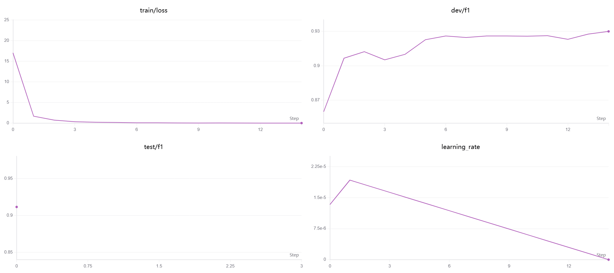
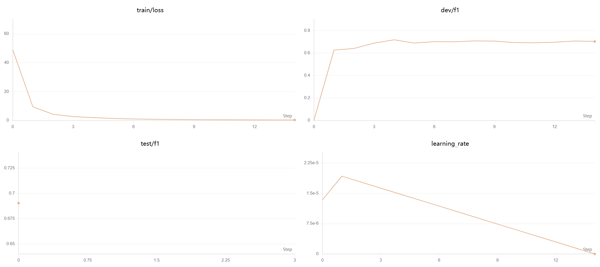
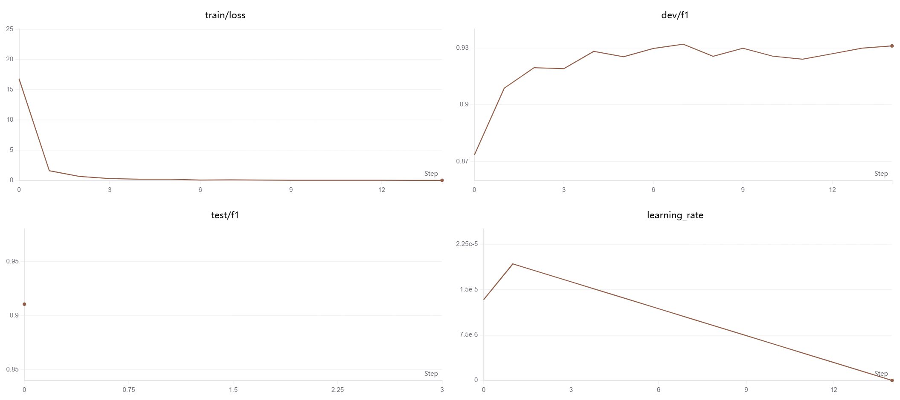
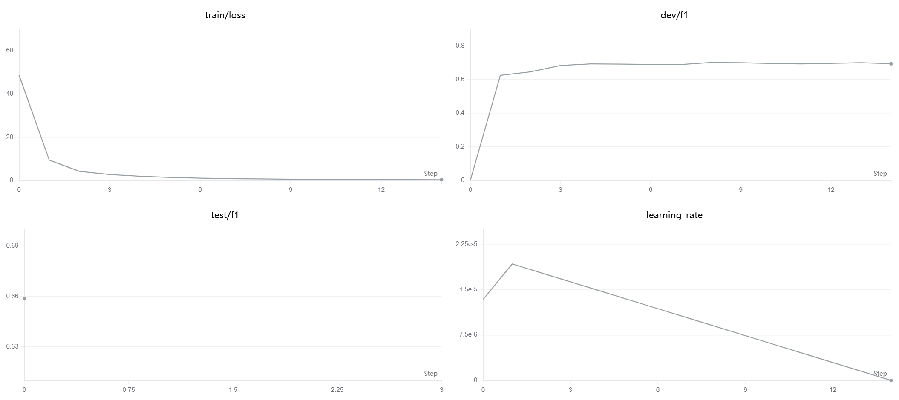

# 基于 BERT 的中文命名实体识别（NER）实验

本项目基于 **PyTorch** 和 **Hugging Face Transformers** 框架，实现了一个完整的中文命名实体识别系统。

模型采用：

> **BERT + BiLSTM + CRF**

结构，通过 BERT 提取上下文语义表示，BiLSTM 建模序列依赖关系，CRF 对标签转移进行全局约束，最终输出最优实体标注序列。

项目使用：

- `bert-base-chinese`
- `chinese-bert-wwm`

两种中文预训练模型，在：

- MSRA 中文 NER 数据集
- Weibo 中文 NER 数据集

上进行实验，并进行了学习率调优分析。


---

# ✨ 项目特点

- ✅ 支持两种中文预训练模型

  - bert-base-chinese
  - chinese-bert-wwm

- ✅ 支持两个公开中文 NER 数据集

  - MSRA NER
  - Weibo NER

- ✅ 完整模型结构
  
  BERT
  ↓
  BiLSTM
  ↓
  CRF
  ↓
  NER 标签序列

- ✅ 分层学习率训练策略

不同模块设置不同学习率：

- BERT 层
- BiLSTM 层
- 分类器层
- CRF 层

- ✅ 完整实验流程

包括：

- 模型训练
- 验证评估
- 测试集预测
- 分类报告输出
- SwanLab 实验记录


---

# 📂 数据集


## 1. MSRA NER 数据集

MSRA 是微软亚洲研究院发布的中文命名实体识别数据集。

数据来源于新闻文本，包含三类实体：

- LOC（地点）
- ORG（组织）
- PER（人物）


共包含 7 个 BIO 标签。


| 标签 | 说明 | 示例 |
|---|---|---|
| O | 非实体 | — |
| B-LOC | 地名开始 | 北（京） |
| I-LOC | 地名内部 | 京 |
| B-ORG | 组织机构开始 | 清（华大学） |
| I-ORG | 组织机构内部 | 华 |
| B-PER | 人名开始 | 张（三） |
| I-PER | 人名内部 | 三 |


---

## 2. Weibo NER 数据集

Weibo 数据集来源于新浪微博。

相比 MSRA，微博文本具有：

- 非正式表达
- 网络用语
- 实体边界复杂
- 噪声较大

等特点。


该数据集包含：

- GPE
- LOC
- ORG
- PER


4 类实体。

每类进一步划分：

- NAM（专有名词）
- NOM（普通名词）


共：

> **17 个标签**

| 标签 | 说明 | 示例 |
|-|-|-|
| O | 非实体 | — |
| B-GPE.NAM | 地缘政治实体-专有名词-开始 | 中（国） |
| I-GPE.NAM | 地缘政治实体-专有名词-内部 | 国 |
| B-GPE.NOM | 地缘政治实体-普通名词-开始 | 国（家） |
| I-GPE.NOM | 地缘政治实体-普通名词-内部 | 家 |
| B-LOC.NAM | 地点-专有名词-开始 | 故（宫） |
| I-LOC.NAM | 地点-专有名词-内部 | 宫 |
| B-LOC.NOM | 地点-普通名词-开始 | 这（里） |
| I-LOC.NOM | 地点-普通名词-内部 | 里 |
| B-ORG.NAM | 组织机构-专有名词-开始 | 阿（里巴巴） |
| I-ORG.NAM | 组织机构-专有名词-内部 | 里 |
| B-ORG.NOM | 组织机构-普通名词-开始 | 公（司） |
| I-ORG.NOM | 组织机构-普通名词-内部 | 司 |
| B-PER.NAM | 人名-专有名词-开始 | 马（云） |
| I-PER.NAM | 人名-专有名词-内部 | 云 |
| B-PER.NOM | 人名-普通名词-开始 | 这（个人） |
| I-PER.NOM | 人名-普通名词-内部 | 个人 |


---

# 📁 项目结构

```text
demo2-ner/
│
├── main.py              # 程序入口，配置数据集和模型
├── model.py             # BERT + BiLSTM + CRF 模型定义
├── trainer.py           # 训练与评估逻辑
├── data_loader.py       # 数据加载与预处理
├── utils.py             # 标签映射、数据读取等工具函数
├── config.py            # 超参数配置
├── requirements.txt     # Python依赖列表
├── README.md
│
├── data/
│   └── ner/
│       ├── MSRA/        # MSRA 数据集
│       └── weibo/       # Weibo 数据集
│
└── images/              # 实验结果图片
    │
    ├── exp1_bert-base-msra/
    ├── exp2_bert-base-weibo/
    ├── exp3_bert-wwm-msra/
    └── exp4_bert-wwm-weibo/
```

---

# ⚙️ 环境配置

## 创建环境

```bash
conda create -n demo2 python=3.10

conda activate demo2
```

安装依赖：

```bash
pip install -r requirements.txt
```

## 核心依赖

| 软件 | 版本 |
|---|---|
| Python | 3.10 |
| PyTorch | 2.8.0 |
| Transformers | 4.57.6 |
| seqeval | 1.2.2 |
| torchcrf | 1.1.0 |
| SwanLab | 0.7.14 |


---

# 🚀 运行方式

```bash
python main.py
```

切换数据集或模型时，修改 `main.py` 中的参数：

```python
dataset_name = "msra"   # 可选: "msra" 或 "weibo"

model_name = "/root/demo2/bert_models/bert-base-chinese"
# 或：
# chinese-bert-wwm
```

训练过程会自动记录到 SwanLab，可在浏览器中实时查看训练曲线和指标变化。


---

# 📊 实验结果


## 1. 核心对比实验（2×2矩阵）


| 模型 | 数据集 | 测试 F1 | 最佳验证 F1 |
|---|---|---|---|
| bert-base-chinese | MSRA | 91.14% | 93.20% |
| bert-base-chinese | Weibo | 69.03% | 72.39% |
| chinese-bert-wwm | MSRA | 91.06% | 93.20% |
| chinese-bert-wwm | Weibo | 65.86% | 70.17% |


### 实验分析

- 两个模型在 MSRA 数据集上表现非常接近（91.06%–91.14%），说明在该任务上两者性能相当。

- Weibo 数据集的 F1 比 MSRA 低约 20 个百分点，主要原因在于社交媒体文本噪声大、实体表达不规范、网络用语频繁。

- 在 Weibo 上，bert-base-chinese 比 chinese-bert-wwm 高出约 3.2 个百分点，表明在该场景下 bert-base-chinese 具有更好的泛化能力。


---

# 2. 超参数调优实验（Weibo + bert-base-chinese）


固定其他超参数：

| 参数 | 设置 |
|---|---|
| batch_size | 16 |
| hidden_size | 256 |
| dropout | 0.2 |


仅调整 BERT 层学习率：

| BERT层学习率 | 测试 F1 | 最佳验证 F1 |
|---|---|---|
| 1e-5 | 67.10% | 72.34% |
| 2e-5 | 69.03% | 72.39% |
| 3e-5 | 68.85% | 70.29% |
| 5e-5 | 68.33% | 72.39% |


### 实验分析

- 学习率从 1e-5 提高到 2e-5 时，F1 上升约 2 个百分点；超过 2e-5 后，性能逐渐下降。

- 最优学习率为 2e-5。

- 整体来看，学习率在 1e-5 到 5e-5 范围内，F1 的波动幅度在 2% 以内，模型对该区间具有一定鲁棒性。


---

# 3. 各实验详细分类报告


## 实验一：bert-base-chinese + MSRA（F1: 91.14%）


| 实体类型 | precision | recall | f1-score | support |
|---|---|---|---|---|
| LOC | 0.91 | 0.91 | 0.91 | 632 |
| ORG | 0.85 | 0.88 | 0.86 | 268 |
| PER | 0.95 | 0.96 | 0.96 | 361 |
| 加权平均 | 0.91 | 0.92 | 0.91 | 1261 |


实验结果：




---

## 实验二：bert-base-chinese + Weibo（F1: 69.03%）


| 实体类型 | precision | recall | f1-score | support |
|---|---|---|---|---|
| GPE.NAM | 0.77 | 0.96 | 0.85 | 46 |
| GPE.NOM | 0.00 | 0.00 | 0.00 | 2 |
| LOC.NAM | 0.39 | 0.37 | 0.38 | 19 |
| LOC.NOM | 0.43 | 0.33 | 0.38 | 9 |
| ORG.NAM | 0.40 | 0.46 | 0.43 | 39 |
| ORG.NOM | 0.78 | 0.44 | 0.56 | 16 |
| PER.NAM | 0.78 | 0.78 | 0.78 | 112 |
| PER.NOM | 0.70 | 0.73 | 0.72 | 169 |
| 加权平均 | 0.68 | 0.70 | 0.69 | 412 |


实验结果：




---

## 实验三：chinese-bert-wwm + MSRA（F1: 91.06%）


| 实体类型 | precision | recall | f1-score | support |
|---|---|---|---|---|
| LOC | 0.93 | 0.90 | 0.92 | 632 |
| ORG | 0.86 | 0.86 | 0.86 | 268 |
| PER | 0.93 | 0.94 | 0.94 | 361 |
| 加权平均 | 0.92 | 0.90 | 0.91 | 1261 |


实验结果：




---

## 实验四：chinese-bert-wwm + Weibo（F1: 65.86%）


| 实体类型 | precision | recall | f1-score | support |
|---|---|---|---|---|
| GPE.NAM | 0.74 | 0.87 | 0.80 | 46 |
| GPE.NOM | 0.00 | 0.00 | 0.00 | 2 |
| LOC.NAM | 0.25 | 0.37 | 0.30 | 19 |
| LOC.NOM | 0.29 | 0.22 | 0.25 | 9 |
| ORG.NAM | 0.44 | 0.44 | 0.44 | 39 |
| ORG.NOM | 0.64 | 0.44 | 0.52 | 16 |
| PER.NAM | 0.70 | 0.75 | 0.72 | 112 |
| PER.NOM | 0.70 | 0.72 | 0.71 | 169 |
| 加权平均 | 0.64 | 0.68 | 0.66 | 412 |


实验结果：




---

# 🔍 关键发现


- MSRA 数据集上两种模型性能差异很小：F1 仅相差 0.08 个百分点，说明二者在规范文本上的表现十分接近。

- Weibo 数据集更具区分度：bert-base-chinese 优于 chinese-bert-wwm 约 3.2 个百分点，可能与预训练数据分布差异有关。

- 人名（PER）识别效果最好：所有实验中 PER 的 F1 都是最高的。

- 机构名（ORG）识别难度最大：Weibo 上 ORG.NOM 仅有 16 条训练样本，模型难以捕捉有效特征。

- 样本量对性能影响显著：GPE.NOM（2 条）、LOC.NOM（9 条）等少数类在测试集中几乎无法被正确识别。


---

# ⚙️ 参数配置详情


## 基础超参数


| 参数 | MSRA实验值 | Weibo实验值 |
|---|---|---|
| batch_size | 32 | 16 |
| lstm_hidden_size | 256 | 256 |
| lstm_layers | 1 | 1 |
| dropout | 0.2 | 0.2 |
| epochs | 10 | 15 |
| warmup_ratio | 0.1 | 0.1 |
| weight_decay | 0.01 | 0.01 |
| max_seq_len | 128 | 128 |


## 分层学习率


| 参数 | 学习率 |
|---|---|
| BERT层 | 2e-5 |
| BiLSTM层 | 1e-3 |
| 分类器层 | 1e-3 |
| CRF层 | 1e-3 |


---

# 💻 实验环境


| 项目 | 配置 |
|---|---|
| 操作系统 | Ubuntu 22.04 |
| GPU | NVIDIA GeForce RTX 5090 (32GB) |
| Python | 3.10 |
| PyTorch | 2.8.0+cu128 |
| Transformers | 4.57.6 |


---

# 📚 参考

- bert-base-chinese

- chinese-bert-wwm

- MSRA NER 数据集

- Weibo NER 数据集

- SwanLab 实验可视化工具
