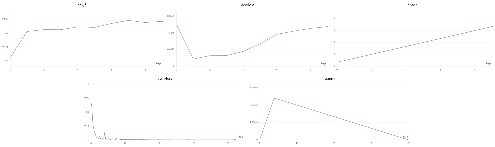
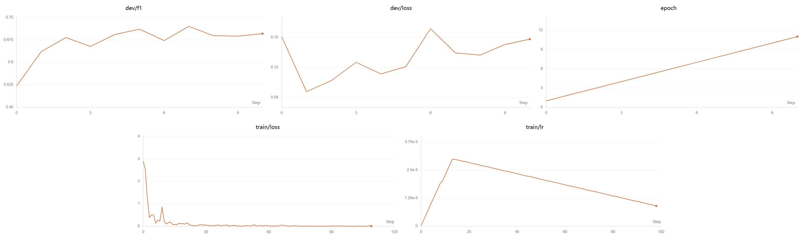
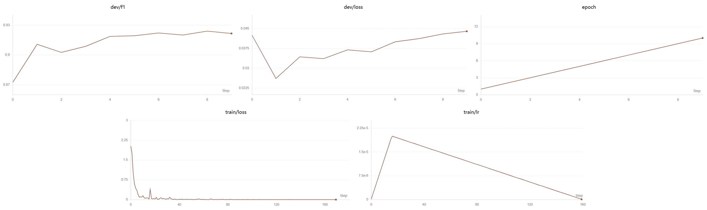
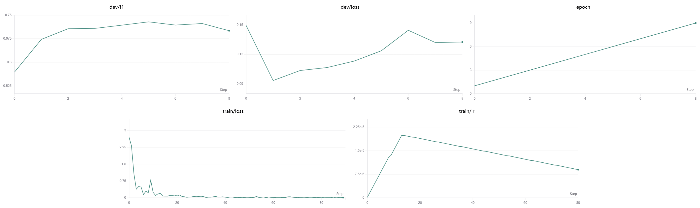

# 基于 BERT 的中文命名实体识别（NER）实验

本项目基于 **PyTorch** 和 **Hugging Face Transformers** 框架，实现了一个完整的中文命名实体识别系统。

模型采用：

> **BERT + BiLSTM + 线性分类层**

结构，通过 BERT 提取上下文语义表示，BiLSTM 建模序列依赖关系，线性层输出标签概率分布，最终输出最优实体标注序列。

项目使用：

- `bert-base-chinese`
- `chinese-bert-wwm`

两种中文预训练模型，在：

- MSRA 中文 NER 数据集
- Weibo 中文 NER 数据集

上进行实验，并进行了学习率调优分析。


---

# ✨ 项目特点

- ✅ 支持两种中文预训练模型

  - bert-base-chinese
  - chinese-bert-wwm

- ✅ 支持两个公开中文 NER 数据集

  - MSRA NER
  - Weibo NER

- ✅ 完整模型结构

  BERT
  ↓
  BiLSTM
  ↓
  Linear
  ↓
  NER 标签序列

- ✅ 分层学习率训练策略

不同模块设置不同学习率：

- BERT 层（2e-5）
- BiLSTM 层（1e-3）
- 分类器层（1e-3）

- ✅ 完整实验流程

包括：

- 模型训练
- 验证评估
- 测试集预测
- 分类报告输出
- SwanLab 实验记录


---

# 📂 数据集


## 1. MSRA NER 数据集

MSRA 是微软亚洲研究院发布的中文命名实体识别数据集。

数据来源于新闻文本，包含三类实体：

- LOC（地点）
- ORG（组织）
- PER（人物）


共包含 7 个 BIO 标签。


| 标签 | 说明 | 示例 |
|---|---|---|
| O | 非实体 | — |
| B-LOC | 地名开始 | 北（京） |
| I-LOC | 地名内部 | 京 |
| B-ORG | 组织机构开始 | 清（华大学） |
| I-ORG | 组织机构内部 | 华 |
| B-PER | 人名开始 | 张（三） |
| I-PER | 人名内部 | 三 |


---

## 2. Weibo NER 数据集

Weibo 数据集来源于新浪微博。

相比 MSRA，微博文本具有：

- 非正式表达
- 网络用语
- 实体边界复杂
- 噪声较大

等特点。


该数据集包含：

- GPE
- LOC
- ORG
- PER


4 类实体。

每类进一步划分：

- NAM（专有名词）
- NOM（普通名词）


共：

> **17 个标签**

| 标签 | 说明 | 示例 |
|-|-|-|
| O | 非实体 | — |
| B-GPE.NAM | 地缘政治实体-专有名词-开始 | 中（国） |
| I-GPE.NAM | 地缘政治实体-专有名词-内部 | 国 |
| B-GPE.NOM | 地缘政治实体-普通名词-开始 | 国（家） |
| I-GPE.NOM | 地缘政治实体-普通名词-内部 | 家 |
| B-LOC.NAM | 地点-专有名词-开始 | 故（宫） |
| I-LOC.NAM | 地点-专有名词-内部 | 宫 |
| B-LOC.NOM | 地点-普通名词-开始 | 这（里） |
| I-LOC.NOM | 地点-普通名词-内部 | 里 |
| B-ORG.NAM | 组织机构-专有名词-开始 | 阿（里巴巴） |
| I-ORG.NAM | 组织机构-专有名词-内部 | 里 |
| B-ORG.NOM | 组织机构-普通名词-开始 | 公（司） |
| I-ORG.NOM | 组织机构-普通名词-内部 | 司 |
| B-PER.NAM | 人名-专有名词-开始 | 马（云） |
| I-PER.NAM | 人名-专有名词-内部 | 云 |
| B-PER.NOM | 人名-普通名词-开始 | 这（个人） |
| I-PER.NOM | 人名-普通名词-内部 | 个人 |


---

# 📁 项目结构

```text
demo2-ner/
│
├── main.py              # 程序入口，配置数据集和模型
├── model.py             # BERT + BiLSTM + Linear 模型定义
├── trainer.py           # 训练与评估逻辑
├── config.py            # 配置类（从 JSON 加载）
├── requirements.txt     # Python依赖列表
├── README.md
│
├── configs/
│   ├── msra_config.json # MSRA 数据集配置
│   └── weibo_config.json # Weibo 数据集配置
│
├── utils/
│   ├── __init__.py
│   ├── data_loader.py   # 数据加载与预处理
│   ├── metrics.py       # NER F1 计算
│   └── analyzer.py      # 数据统计分析
│
├── data/
│   ├── MSRA/            # MSRA 数据集
│   └── weibo/           # Weibo 数据集
│
└── images/              # 实验结果图片
    ├── exp1_bert-base-msra_combined.png
    ├── exp2_bert-base-weibo_combined.png
    ├── exp3_bert-wwm-msra_combined.png
    └── exp4_bert-wwm-weibo_combined.png
```


---

# ⚙️ 环境配置

## 创建环境

```bash
conda create -n demo2 python=3.10

conda activate demo2
```

安装 PyTorch
注意：本项目使用 RTX 5090 显卡，需要 PyTorch 2.8.0+ 及 CUDA 12.8 支持。

针对 RTX 50 系显卡（CUDA 12.8）：

bash
pip install torch==2.8.0 torchvision==0.23.0 torchaudio==2.8.0 --index-url https://download.pytorch.org/whl/cu128
如果你的显卡不是 RTX 50 系或 CUDA 版本不同，请根据 PyTorch 官网 的指引选择合适的安装命令。

安装其他依赖
bash
pip install -r requirements.txt
核心依赖
软件	版本
Python	3.10
PyTorch	2.8.0+cu128
Transformers	4.57.6
SwanLab	0.7.14
---

# 🚀 运行方式

```bash
python main.py
```

切换数据集或模型时，修改 `main.py` 中的参数：

```python
dataset_name = "msra"   # 可选: "msra" 或 "weibo"

model_name = "bert-base-chinese"   # 可选: "bert-base-chinese" 或 "chinese-bert-wwm"
```

训练过程会自动记录到 SwanLab，可在浏览器中实时查看训练曲线和指标变化。


---

# 📊 实验结果


## 1. 核心对比实验（2×2矩阵）


| 模型 | 数据集 | 测试 F1 | 最佳验证 F1 |
|---|---|---|---|
| bert-base-chinese | MSRA | 90.28% | 91.44% |
| bert-base-chinese | Weibo | 69.24% | 73.23% |
| chinese-bert-wwm | MSRA | 86.96% | 89.07% |
| chinese-bert-wwm | Weibo | 67.16% | 72.87% |


### 实验分析

- bert-base-chinese 在两个数据集上均优于 chinese-bert-wwm：MSRA 上高出约 3.32 个百分点，Weibo 上高出约 2.08 个百分点，表明在该任务上 bert-base-chinese 的适应性更强。

- Weibo 数据集的 F1 比 MSRA 低约 21-22 个百分点，主要原因在于社交媒体文本噪声大、实体表达不规范、网络用语频繁。

- 在 MSRA 上，BERT + BiLSTM + Linear 已达到 90%+ F1，说明移除 CRF 后性能依然优秀。

- 在 Weibo 上，移除 CRF 后性能基本持平（69.24% vs 第一版 69.03%），说明 CRF 在噪声数据上帮助有限。


---

## 2. 超参数调优实验（Weibo + bert-base-chinese）


固定其他超参数：

| 参数 | 设置 |
|---|---|
| batch_size | 16 |
| hidden_size | 256 |
| dropout | 0.2 |


仅调整 BERT 层学习率：

| BERT层学习率 | 测试 F1 | 最佳验证 F1 |
|---|---|---|
| 1e-5 | 66.91% | 73.10% |
| **2e-5** | **69.24%** | **73.23%** |
| 3e-5 | 68.67% | 72.77% |
| 5e-5 | 67.52% | 71.95% |


### 实验分析

- 学习率从 1e-5 提高到 2e-5 时，测试 F1 上升约 **2.33 个百分点**（66.91% → 69.24%），提升明显；超过 2e-5 后，性能逐渐下降，3e-5 和 5e-5 的测试 F1 分别下降 0.57 和 1.72 个百分点。

- **最优学习率为 2e-5**，验证集和测试集表现最平衡，泛化能力最好。

- 1e-5 时验证 F1（73.10%）与测试 F1（66.91%）差距最大（4.19 个百分点），说明学习率偏小时模型在验证集上过拟合，泛化能力较弱。

- 5e-5 时训练较早触发 Early Stopping（第 8 轮），表明学习率过大导致训练不稳定，模型难以充分收敛。


---

## 3. 各实验详细分类报告


### 实验一：bert-base-chinese + MSRA（F1: 90.28%）


| 实体类型 | precision | recall | f1-score | support |
|---|---|---|---|---|
| LOC | 0.9019 | 0.9019 | 0.9019 | 632 |
| ORG | 0.8582 | 0.8812 | 0.8696 | 261 |
| PER | 0.9363 | 0.9210 | 0.9286 | 367 |
| 加权平均 | 0.9025 | 0.9032 | 0.9028 | 1260 |


实验结果：




---

### 实验二：bert-base-chinese + Weibo（F1: 69.24%）


| 实体类型 | precision | recall | f1-score | support |
|---|---|---|---|---|
| GPE.NAM | 0.8913 | 0.7885 | 0.8367 | 52 |
| GPE.NOM | 0.0000 | 0.0000 | 0.0000 | 0 |
| LOC.NAM | 0.1579 | 0.3750 | 0.2222 | 8 |
| LOC.NOM | 0.1111 | 0.3333 | 0.1667 | 3 |
| ORG.NAM | 0.4615 | 0.5143 | 0.4865 | 35 |
| ORG.NOM | 0.5000 | 0.7273 | 0.5926 | 11 |
| PER.NAM | 0.7727 | 0.7798 | 0.7763 | 109 |
| PER.NOM | 0.7305 | 0.6893 | 0.7093 | 177 |
| 加权平均 | 0.6814 | 0.7038 | 0.6924 | 395 |


实验结果：




---

### 实验三：chinese-bert-wwm + MSRA（F1: 86.96%）


| 实体类型 | precision | recall | f1-score | support |
|---|---|---|---|---|
| LOC | 0.8956 | 0.8830 | 0.8892 | 641 |
| ORG | 0.8172 | 0.8588 | 0.8375 | 255 |
| PER | 0.9003 | 0.8207 | 0.8587 | 396 |
| 加权平均 | 0.8803 | 0.8591 | 0.8696 | 1292 |


实验结果：




---

### 实验四：chinese-bert-wwm + Weibo（F1: 67.16%）


| 实体类型 | precision | recall | f1-score | support |
|---|---|---|---|---|
| GPE.NAM | 0.8478 | 0.7358 | 0.7879 | 53 |
| GPE.NOM | 0.0000 | 0.0000 | 0.0000 | 0 |
| LOC.NAM | 0.2632 | 0.3846 | 0.3125 | 13 |
| LOC.NOM | 0.4444 | 0.6667 | 0.5333 | 6 |
| ORG.NAM | 0.4103 | 0.5714 | 0.4776 | 28 |
| ORG.NOM | 0.3750 | 0.6667 | 0.4800 | 9 |
| PER.NAM | 0.7545 | 0.6917 | 0.7217 | 120 |
| PER.NOM | 0.7246 | 0.6760 | 0.6994 | 179 |
| 加权平均 | 0.6716 | 0.6716 | 0.6716 | 408 |


实验结果：




---

# 🔍 关键发现


- bert-base-chinese 在两个数据集上均优于 chinese-bert-wwm：MSRA 上高出约 3.32 个百分点，Weibo 上高出约 2.08 个百分点，表明在该任务上 bert-base-chinese 的适应性更强。

- MSRA 数据集的 F1 远高于 Weibo（差距约 21-22 个百分点），说明新闻文本的 NER 任务明显比社交媒体文本容易。

- 在 MSRA 上，移除 CRF 后性能依然优秀（90%+ F1），说明 BERT + BiLSTM + Linear 结构在规范文本上已足够强大。

- 人名（PER）识别效果最好：所有实验中 PER 的 F1 都是最高的。

- 机构名（ORG）识别难度最大：Weibo 上 ORG 的 F1 在 0.48-0.59 之间，远低于 PER 和 GPE。

- 样本量对性能影响显著：LOC.NAM（8 条）、LOC.NOM（3 条）等少数类在测试集中识别效果较差，说明数据稀缺对模型性能影响明显。


---

# ⚙️ 参数配置详情


## 基础超参数


| 参数 | MSRA实验值 | Weibo实验值 |
|---|---|---|
| batch_size | 32 | 16 |
| lstm_hidden_size | 256 | 256 |
| lstm_layers | 1 | 1 |
| dropout | 0.2 | 0.2 |
| epochs | 10 | 15 |
| warmup_ratio | 0.1 | 0.1 |
| weight_decay | 0.01 | 0.01 |
| max_seq_len | 128 | 128 |


## 分层学习率


| 参数 | 学习率 |
|---|---|
| BERT层 | 2e-5 |
| BiLSTM层 | 1e-3 |
| 分类器层 | 1e-3 |


---

# 💻 实验环境


| 项目 | 配置 |
|---|---|
| 操作系统 | Ubuntu 22.04 |
| GPU | NVIDIA GeForce RTX 5090 (32GB) |
| Python | 3.10 |
| PyTorch | 2.8.0+cu128 |
| Transformers | 4.57.6 |


---

# 📚 参考

- bert-base-chinese

- chinese-bert-wwm

- MSRA NER 数据集

- Weibo NER 数据集

- SwanLab 实验可视化工具
